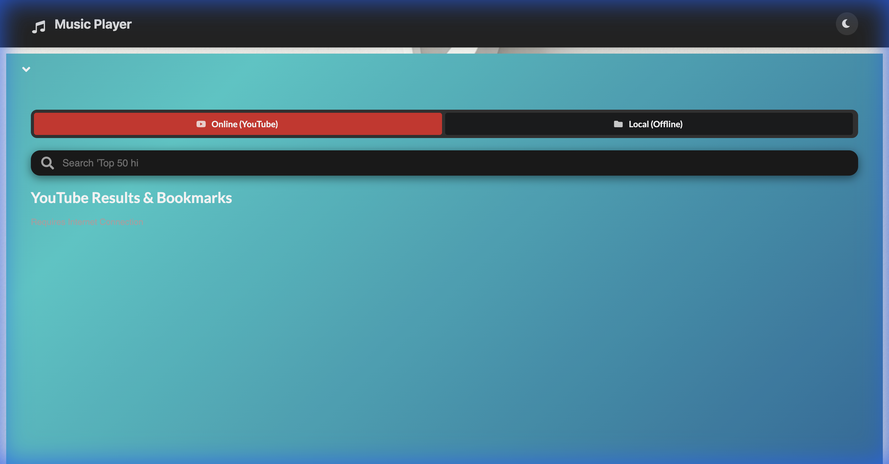
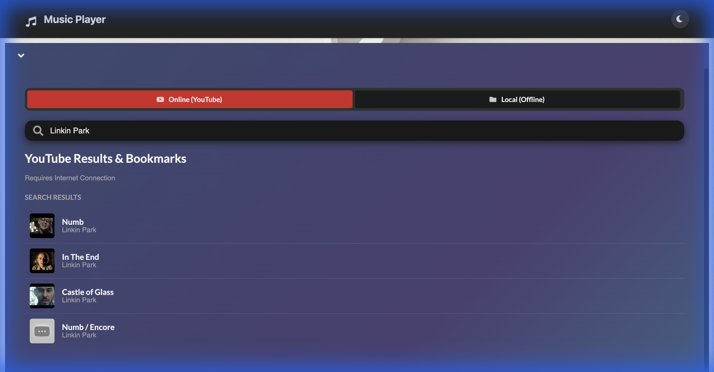
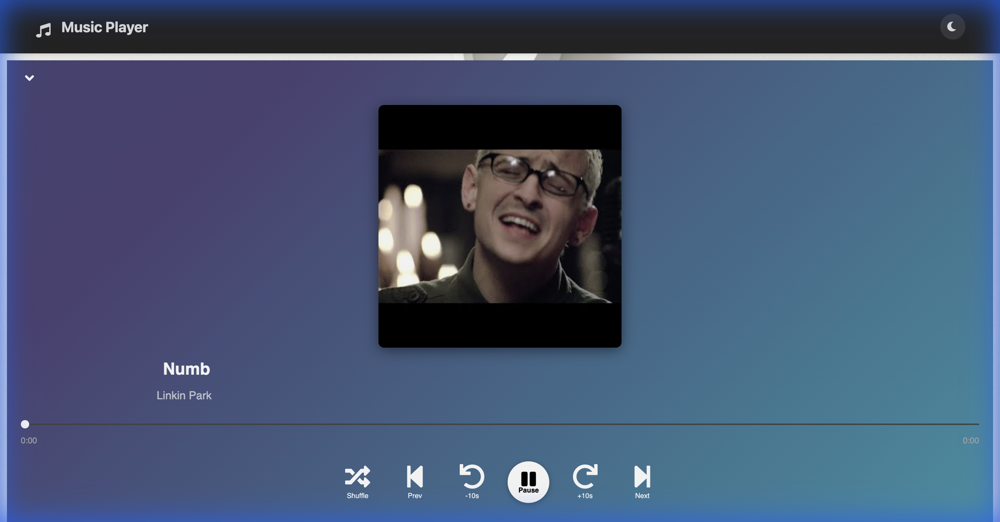
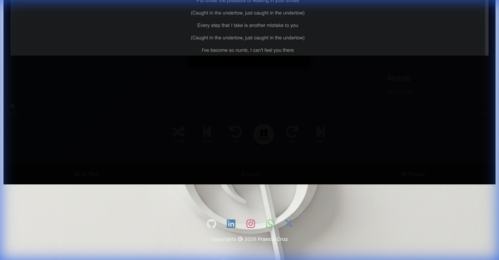

# 🎵 Advanced React Music Player (PWA Client-Side)

A powerful, modern, and completely client-side Music Player built with React.
Supports both **Local Audio Files/Folders** and **Unlimited YouTube Streaming** via multi-key rotation.



## 🚀 Live Demo / Features

### 🎧 Online Mode (YouTube)
*   **Unlimited Search**: Bypasses daily quotas using smart **Multi-Key Rotation**.
*   **Instant Search**: Results appear instantly as you type.
*   **Clean UI**: Focuses on the music (distraction-free).
*   **Thumbnails**: Shows real album art in search results.
*   **Duration**: Supports long songs/mixes (HH:MM:SS format).

### 📂 Local Mode (Offline)
*   **Folder Support**: Import entire folders or multiple files.
*   **Pro Tools**: Drag-to-Loop waveform, BPM detection, Key detection.
*   **Speed Control**: Variable playback speed (0.25x - 4.00x).
*   **Sort**: Automatically sorts files A-Z.
*   **Smart Filter**: Only shows valid audio files.

### 📱 PWA & Mobile
*   **Installable**: "Add to Home Screen" on iOS/Android.
*   **Lock Screen**: Full media controls and artwork on your phone's lock screen.
*   **Shortcuts**: Quick actions via app icon long-press.

## � Screenshots

### Online Search Results


### Music Player


### Lyrics View


## �🛠️ Installation

This is a pure client-side app (no backend server required).

1.  **Clone the repository**:
    ```bash
    git clone https://github.com/ajf013/musicplayerreact.git
    cd musicplayerreact
    ```

2.  **Install Dependencies**:
    ```bash
    npm install
    ```

3.  **Run Locally**:
    ```bash
    npm run dev
    ```
    Open `http://localhost:5173` (or your Network IP for mobile).

## ☁️ Deployment (Netlify/Vercel)

Since there is no backend, you can deploy this for free on Netlify/Vercel.

### Adding API Keys (Netlify)
To enable the **Unlimited Search**, adds your YouTube API Keys in the deployment settings:
1.  Go to **Site Settings** > **Environment Variables**.
2.  Key: `VITE_YOUTUBE_API_KEYS`
3.  Value: `YOUR_KEY_1,YOUR_KEY_2,YOUR_KEY_3` (Comma separated).

## 📜 License
MIT License.