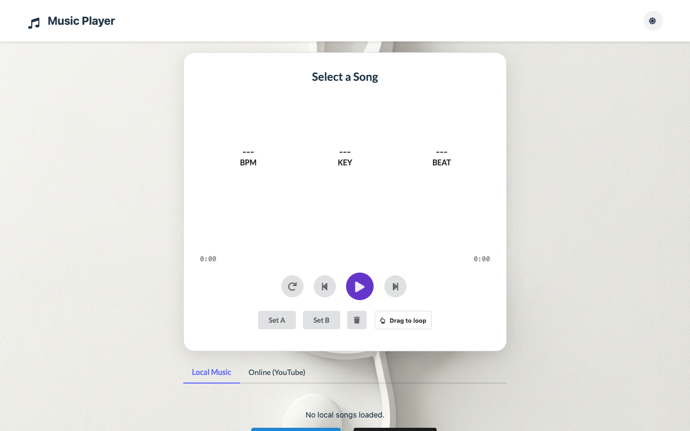
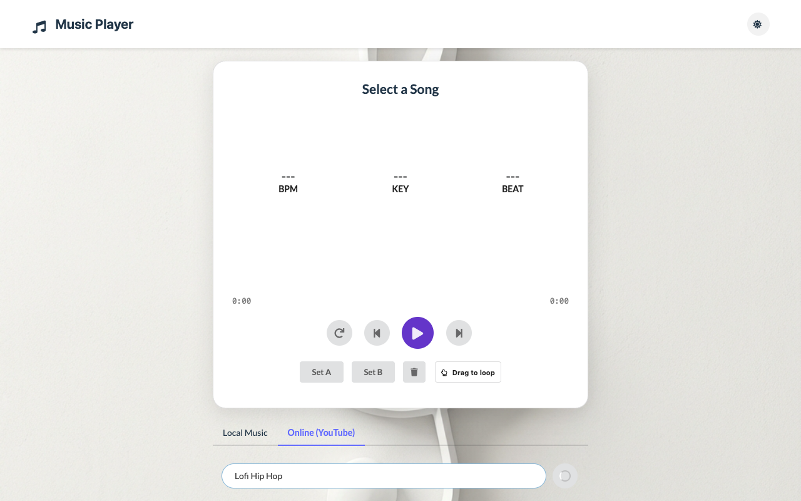
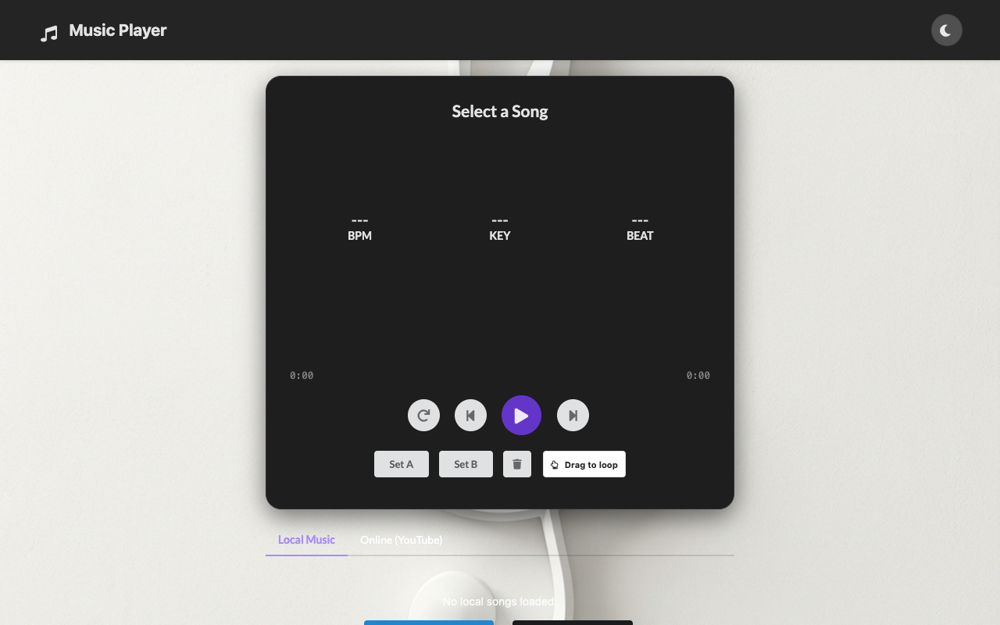
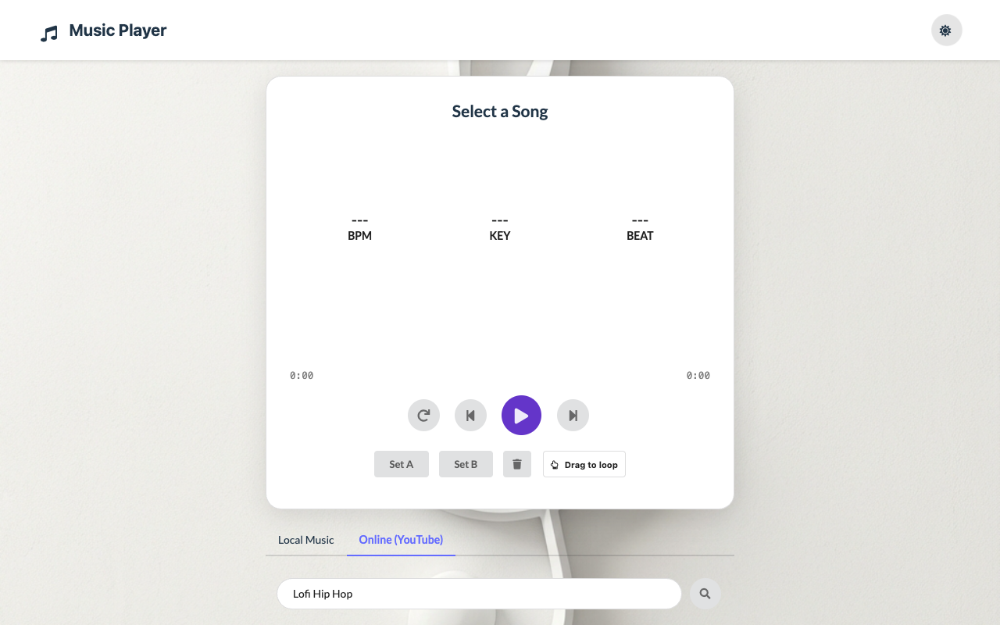

# 🎵 React Music Player PWA

A modern, feature-rich Music Player built with **React**, **Vite**, and **Semantic UI**. This Progressive Web App (PWA) supports local file playback, online streaming (YouTube), dynamic audio visualization, and advanced A-B looping capabilities.

## 🌐 Live Demo

🔗 **Live Site:** 
[https://songplayerapp.netlify.app/](https://songplayerapp.netlify.app/)

## ✨ Features

### 🎧 Core Playback
*   **Local Playback**: Play audio files (MP3, WAV, FLAC, etc.) directly from your device storage. Supports folder selection.
*   **Online Integration**: Search and play songs from **YouTube** directly within the app.
*   **Waveform Control**: Interactive waveform navigation using `wavesurfer.js`.
*   **A-B Loop**: Drag-to-select regions on the waveform or use "Set A/B" buttons for precise looping (Local files only).

### 🎨 Visuals & UI
*   **Dynamic Visualizer**: Real-time frequency bar graph visualization that syncs with the music.
*   **Simulated Visualizer**: Automatic simulated mode for online streams (where raw audio is restricted).
*   **Theming**: 
    *   **Light Mode**: Clean aesthetic with Treble Clef background.
    *   **Dark Mode**: Immersive experience with Bass Clef background and neon accents.
*   **Responsive Design**: Fully optimized for Mobile and Desktop.

### 🚀 Technical
*   **PWA**: Installable app with offline capabilities (cached assets).
*   **Audio Analysis**: Real-time BPM detection and Key/Time signature estimation.
*   **Privacy**: Local files never leave your device. YouTube API keys are stored in local `.env`.

---

## 🛠️ Installation & Setup

1.  **Clone the repository**
    ```bash
    git clone https://github.com/ajf013/musicplayerreact.git
    cd musicplayerreact
    ```

2.  **Install Dependencies**
    ```bash
    npm install
    ```

3.  **Setup Environment Variables** (Required for YouTube)
    *   Create a `.env` file in the root directory.
    *   Add your YouTube Data API Key:
    ```env
    VITE_YOUTUBE_API_KEY=your_api_key_here
    ```
    *   *Note: Without a key, the app will use Mock Data for demonstration.*

4.  **Run Locally**
    ```bash
    npm run dev
    ```

5.  **Build**
    ```bash
    npm run build
    ```

---

## 📸 Screenshots

### Home Page


### YouTube Search


### Music Player


### Dark Mode


### Light Mode


---

## 📄 License

Distributed under the MIT License. See `LICENSE` for more information.

## You can reach out 😊😊
Feel free to contact me about the problems. I will try to help as much as I can 😉

[](https://www.linkedin.com/in/ajf013-francis-cruz/)
[](mailto:cruzmma2021@gmail.com)
[](https://github.com/ajf013)