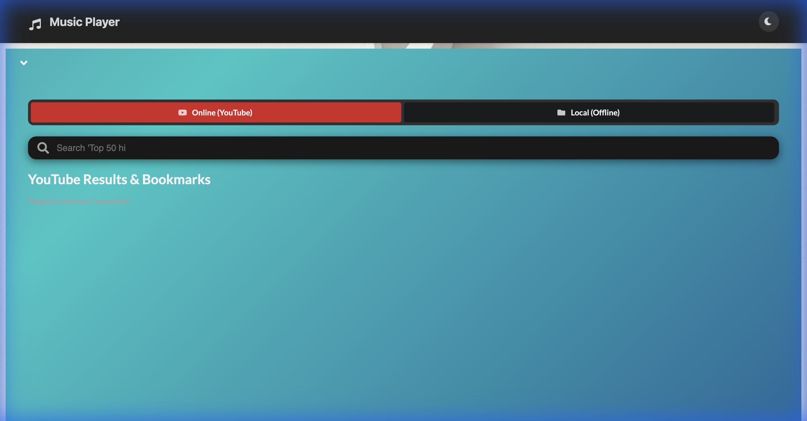
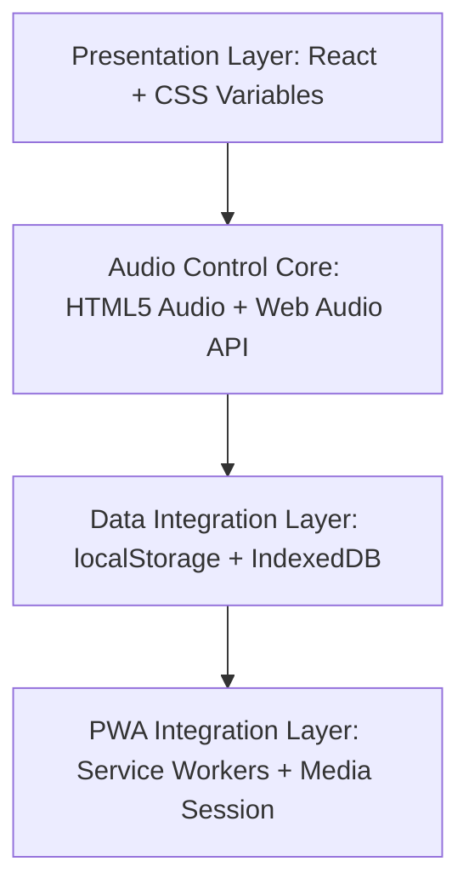
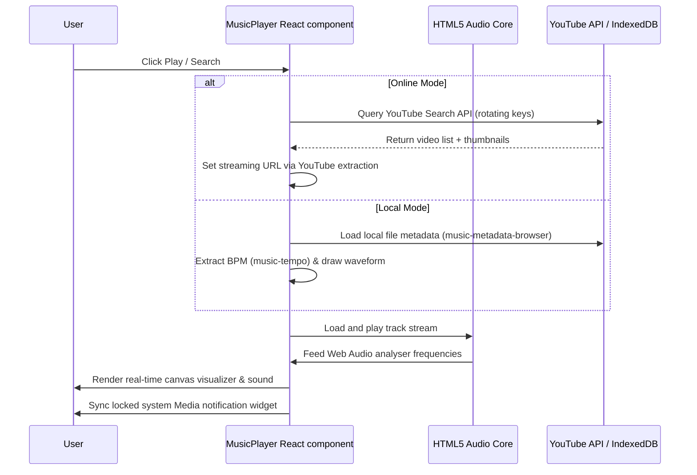

# 🎵 Advanced React Music Player (PWA Client-Side)

A powerful, modern, and completely client-side Music Player built with React and styled with a premium glassmorphic theme. 
Supports both **Local Audio Files/Folders** (with offline caching, wave looping, BPM detection) and **Unlimited YouTube Streaming** via multi-key rotation.



---

## ⚡ Key Architectural Features & Recent Updates

*   **Immersive Responsive UI Layout**: Replaced default Vite wrappers and layout constraints to provide a locked, app-like viewport context (`100vh`/`100dvh`). Sizing scales automatically across all viewport sizes, ensuring bottom tabs and playback actions are never cut off.
*   **System-Level Media Integration**: Implements HTML5 **Media Session API** controls to provide dynamic playback widgets in your mobile notification drawer and lock screens (including song metadata, cover artwork, progress bars, and play controls).
*   **Adaptive Glassmorphic Theme Switching**: Fixed theme toggling to dynamically switch CSS variables, global background images, lists, inputs, and modals between Light and Dark mode variants.
*   **Loop Waveforms & BPM/Key Tooling**: Integrates `wavesurfer.js` to draw audio waveforms directly on local tracks. Allows drag-to-loop playback controls, automated BPM (tempo) calculations, and key estimation.

---

## 📱 PWA & Mobile Support

*   **Installable**: "Add to Home Screen" enabled via standard Web App Manifest (`manifest.webmanifest`).
*   **Offline Access**: Precise client-side routing and cache structures keep local media and downloads playing even without internet access.
*   **Android / Desktop Shortcuts**: long-press application icon to directly navigate into Offline, Favorites, or Online Search modes.

---

## 📂 Project Directory Structure

Below is the directory tree layout of the codebase:

```text
├── .env                  # Environment configuration (YouTube API Keys) - [Git-ignored]
├── .env.example          # Sample environment variables configuration template
├── .gitignore            # Git exclusion rules (safeguards .env keys from leaks)
├── index.html            # Main HTML document entry point
├── package.json          # Node dependencies & project scripts
├── vite.config.js        # Vite build config & PWA service worker setup
├── src/
│   ├── main.jsx          # App entry point (mounts React to DOM)
│   ├── App.jsx           # Root layout manager, holds global theme and splash state
│   ├── App.css           # Global layout adjustments for full-screen sizing
│   ├── index.css         # CSS reset, theme variables, and global background setups
│   ├── assets/           # Media resources
│   │   ├── react.svg
│   │   ├── default_artwork.png
│   │   └── backgrounds/
│   │       ├── light-bg.png
│   │       └── dark-bg.png
│   └── components/       # App-specific functional components
│       ├── MusicPlayer.jsx     # Main player controller (rendering, logic, and state)
│       ├── MusicPlayer.css     # CSS rules for layouts, play controls, and glassmorphic cards
│       ├── ErrorBoundary.jsx   # Fallback component for rendering errors
│       ├── Lyrics.jsx          # Lyrics sync viewer & LRC files parser
│       ├── SEO.jsx             # React Helmet wrapper for page metadata and microdata
│       ├── SEOContent.jsx      # Crawl-accessible SEO details (visually hidden)
│       ├── YouTubePlayer.jsx   # Low-level YouTube audio extraction helper
│       ├── ReloadPrompt.jsx    # PWA service worker refresh prompt UI
│       └── Header.jsx / Footer.jsx   # Legacy header/footer elements
```

---

## 🏗️ Architecture Design

The player is structured across four main architectural layers to stay lightweight, client-focused, and serverless:


```mermaid
graph TD
    UI[Presentation Layer: React + CSS Variables]
    AC[Audio Control Core: HTML5 Audio + Web Audio API]
    DL[Data Integration Layer: localStorage + IndexedDB]
    PW[PWA Integration Layer: Service Workers + Media Session]

    UI --> AC
    AC --> DL
    DL --> PW
```

1.  **Presentation Layer (Vite + React + CSS Variables)**:
    *   Responsive, flex-based grids scale dynamically inside the screen container.
    *   Centralized design tokens in `index.css` and `MusicPlayer.css` react instantly to the `[data-theme='dark']` body attribute. Hardcoded colors are avoided.
2.  **Audio Control Core (HTML5 + Web Audio API)**:
    *   Leverages the standard `Audio` element instance wrapper for smooth playback.
    *   Uses a Web Audio `AnalyserNode` connected to a `<canvas>` element to compute real-time frequencies, drawing visualizer spectrums directly overlaying the album cover.
    *   Integrates `wavesurfer.js` for custom local waveform rendering and loop boundaries.
3.  **Data Integration Layer (Vite Env + IndexedDB + localStorage)**:
    *   **YouTube Search Rotation**: Directly queries YouTube Data v3 APIs. Integrates a client-side key rotator that shifts query API tokens if a key triggers a rate-limit error (Code 403 / quota exceeded).
    *   **Offline Data Store**: Saves metadata bookmarks to `localStorage`, and stores actual downloaded MP3 files locally into client-side IndexedDB databases using `idb` for browser-based offline play.
4.  **Service Worker / PWA Layer**:
    *   `vite-plugin-pwa` registers a custom service worker that intercepts network requests to fetch static assets offline.
    *   Updates browser lock screen state utilizing `navigator.mediaSession` APIs.

---

## ⚙️ Application Workflow


```mermaid
sequenceDiagram
    participant User
    participant Player as MusicPlayer React component
    participant Engine as HTML5 Audio Core
    participant API as YouTube API / IndexedDB
    
    User->>Player: Click Play / Search
    alt Online Mode
        Player->>API: Query YouTube Search API (rotating keys)
        API-->>Player: Return video list + thumbnails
        Player->>Player: Set streaming URL via YouTube extraction
    else Local Mode
        Player->>API: Load local file metadata (music-metadata-browser)
        Player->>Player: Extract BPM (music-tempo) & draw waveform
    end
    
    Player->>Engine: Load and play track stream
    Engine->>Player: Feed Web Audio analyser frequencies
    Player->>User: Render real-time canvas visualizer & sound
    Player->>User: Sync locked system Media notification widget
```

---

## 🛠️ Installation & Environment Setup

This is a pure client-side app (no backend server required).

1.  **Clone the repository**:
    ```bash
    git clone https://github.com/ajf013/musicplayerreact.git
    cd musicplayerreact
    ```

2.  **Install Dependencies**:
    ```bash
    npm install
    ```

3.  **Environment Configuration (`.env`)**:
    Create a `.env` file in the root directory to store your YouTube Data API developer keys:
    ```env
    VITE_YOUTUBE_API_KEY=YOUR_DEVELOPER_KEY_1,YOUR_DEVELOPER_KEY_2
    ```
    > [!IMPORTANT]
    > **Security & Git**: The `.env` file is listed inside `.gitignore` (`.env` and `.env.local`). This ensures your private API credentials are never committed or exposed on public GitHub repositories. Keep `.env.example` as a template for other contributors.

4.  **Run Locally**:
    ```bash
    npm run dev
    ```
    Open `http://localhost:5173` to start playing music.

---

## 📜 License

MIT License.
